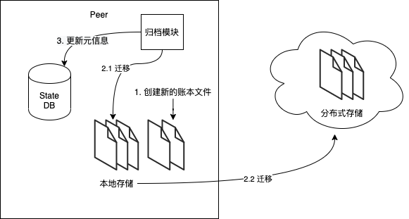
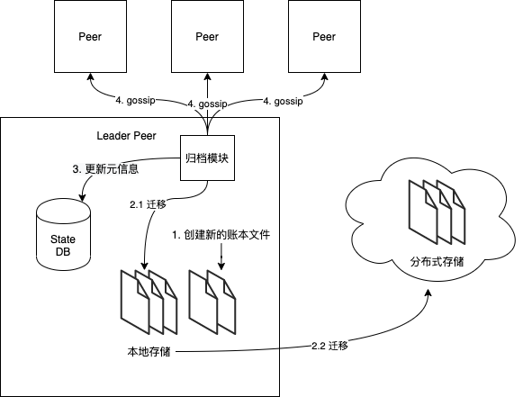

# Ledger Archive

> 作者：彭洪伟（MaxPeng）
>
> 邮件：pengisgood@gmail.com
>
> 最后更新时间：2020年05月19日

**Ledger** 是 Hyperledger Fabric 的一个关键概念。它存储了有关业务对象的重要的事实的信息，既包含属性的当前值，也包含当前值随着历史交易的变化过程。

在本主题中，我们将介绍以下几个方面：

* [账本现状](#账本现状)
* [归档设计概览](#归档设计概览)
* [组件](#组件)
	* [分布式文件存储](#分布式文件存储)
	* [迁移服务](#迁移服务)
	* [归档策略(TODO)](#归档策略)
	* [归档服务(TODO)](#归档服务)
	* [Gossip归档元信息](#Gossip归档元信息)
	* [查询API](#查询API)

## 账本现状

目前 Hyperledger Fabric 中的 Ledger 部分使用本地文件系统进行存储，并且 Hyperledger Fabric 的区块数据结构嵌套很深，单个区块的体积比较大。随着系统的运行，数据量会越来越大，本地文件系统只能垂直扩展，无法水平扩展，无法支持长时间甚至永久存储存储区块链的数据。

## 归档设计概览

考虑区块链的数据需要长时间保存，同时还需要提供历史数据查询。采用常规的方式，将历史数据归档到冷存储无法直接提供历史数据查询功能；而直接将账本中的区块链数据存储改成分布式存储，又会让近期数据的查询性能大幅下降。因此本设计采用近期数据存本地、历史数据存远程的混合存储方式，然后修改历史数据的查询逻辑，按需查询本地账本或者远程账本。远程账本则直接采用成熟的分布式存储技术（比如 Ceph 或者 HDFS）实现，暂不在本设计关心的范围内。本设计中采用的是 HDFS 作为实现案例，不过已经充分考虑到了可扩展性，根据业务的需要，可以很容易的替换底层分布式存储方案。

## 组件

整个归档功能的涉及到的改动如下，本着最小侵入 Hyperledger Fabric 的原则，尽量采用扩展的方式添加新代码，而非直接修改已有逻辑。

### 分布式文件存储

分布式存储采用现有成熟的开源系统，比如 Ceph 或者 HDFS，一般分布式文件存储已经暴露了和本地文件系统类似的 API，底层也已经实现了自动的分片扩容，本设计不关心分布式文件存储的底层实现，仅以 HDFS 作为案例，参考 HDFS 扩展至其他的分布式系统也比较容易。

针对不同的底层的分布式存储，定义了一套统一的接口，用来屏蔽底层存储系统的差异性，尽量做到用户无感知。目前只有 HDFS 的实现，如果需要扩展其他的分布式存储，实现相应的接口即可。

### 迁移服务



该服务的主要职责是将 Peer 节点上的账本文件复制到远端的分布式存储中，该服务只在 Leader Peer 节点上启动。对于动态选举的情景，在每次选举结束之后的 `onStatusChange`方法中启动该服务，之前在其他节点启动的服务会自动停止；对于设置为静态的 Leader 情景，会在 Leader 节点启动的时候启动该服务。静态 Leader 的设置，可能存在单点故障，因此不推荐在生产环境使用。

该服务会以 Go Routine 的方式启动，然后去监控账本目录下文件的变化，一旦有新的账本文件创建，就会根据归档元信息判断，如果 LastSentFileSuffix + 2 号账本文件已经存在，则复制 LastSentFileSuffix 号文件到远端，同时也会检查 LastSentFileSuffix 号之前的文件，如果没有复制，则会从之前的文件开始复制，这样可以避免一次性复制过多的文件导致性能开销过大，也可以保证在查询最近的区块时不用从远端查询。

该服务对外提供的接口如下，由于账本本身的设计就是按照通道进行数据隔离的，该服务的启动和停止的控制也是通道级别的。

``` go
type archiveSvc interface {
   // StartWatcherForChannel dynamically starts watcher of ledger files.
   StartWatcherForChannel(chainID string) error

   // StopWatcherForChannel dynamically stops watcher of ledger files.
   StopWatcherForChannel(chainID string) error

   // Stop stops watcher of ledger files.
   Stop()
}
```

Fabric hyperledger 底层设计了 BlockStore 接口，用于实际操作账本。当前的默认实现为 fsBlockStore，即基于本地文件系统来实现，操作具体账本文件的时候依赖于底层的 blockfileMgr；我们重新实现一个 HybridBlockStore，使用扩展后的 hybridBlockfileMgr 来处理账本复制相关的逻辑。

``` go
type BlockStore interface {
   TransferBlockFiles() error //用于处理具体的账本文件复制逻辑
   AddBlock(block *common.Block) error
   GetBlockchainInfo() (*common.BlockchainInfo, error)
   RetrieveBlocks(startNum uint64) (ledger.ResultsIterator, error)
   RetrieveBlockByHash(blockHash []byte) (*common.Block, error)
   RetrieveBlockByNumber(blockNum uint64) (*common.Block, error) // blockNum of math.MaxUint64 will return last block
   RetrieveTxByID(txID string) (*common.Envelope, error)
   RetrieveTxByBlockNumTranNum(blockNum uint64, tranNum uint64) (*common.Envelope, error)
   RetrieveBlockByTxID(txID string) (*common.Block, error)
   RetrieveTxValidationCodeByTxID(txID string) (peer.TxValidationCode, error)
   Shutdown()
}

type hybridBlockStore struct {
   id      string
   conf    *Conf
   fileMgr *hybridBlockfileMgr //封装处理账本文件的相关逻辑
   stats   *ledgerStats
}
```

hybridBlockfileMgr 会在 Peer 节点启动的时候初始化，主要增加了账本复制的元信息，以及必要的并发控制相关的变量，这些信息都会存储到 LevelDB 中。在启动的时候，会根据远端和本地的账本文件信息初始化归档元信息。

在扩展的结构中，amInfo 用来存储归档的元信息，其中 LastSentFileSuffix 保存已经复制到远端的最大文件编号，LastArchiveFileSuffix 保存已经从 Peer 节点删除的最大文件编号，FileProofs 保存账本文件的校验码，后续可以用来验证远端的账本文件内容是否完整。amInfoCond 和 lock 用于在更新元信息时的并发控制。dfsClient 为底层分布式存储的抽象，用来和分布式存储系统进行交互。

``` go
type hybridBlockfileMgr struct {
   rootDir           string
   conf              *Conf
   db                *leveldbhelper.DBHandle
   index             index
   cpInfo            *checkpointInfo
   cpInfoCond        *sync.Cond
   currentFileWriter *blockfileWriter
   bcInfo            atomic.Value

   // 归档元信息
   amInfo            *archive.ArchiveMetaInfo
   amInfoCond        *sync.Cond
   dfsClient         common.FsClient
   lock              sync.RWMutex
}
```

``` protobuf
package archive;

message ArchiveMetaInfo {
    int32 last_sent_file_suffix = 1;
    int32 last_archive_file_suffix = 2;
    map<int32, string> file_proofs = 3;
}
```

### 归档策略(TODO)

TODO

### 归档服务(TODO)

TODO

### Gossip归档元信息



账本文件的复制只会发生在 Leader 节点，因此归档的元信息就需要从 Leader 节点通过 Gossip 广播给通道里其他的 Peer 节点，其他的节点收到 Gossip 消息之后，更新到自己的 LevelDB 中。

增加的Gossip消息类型如下，

``` protobuf
// ArchiveMsg is used for peer leader to broadcast its archive meta information
// to other peers
message ArchiveMsg {
    ArchiveMetaInfo archive_meta_info = 1;
}

message ArchiveMetaInfo {
    int32 last_sent_file_suffix = 1;
    int32 last_archive_file_suffix = 2;
    map<int32, string> file_proofs = 3;
}
```

在 Leader 节点启动迁移服务的时候和有新的账本文件创建的时候都会触发Gossip，构造的消息如下，

``` go
gossipMsg := &GossipMessage{
    Nonce:   0,
    Tag:     proto.GossipMessage_CHAN_ONLY,
    Channel: []byte(chainID),
    Content: &proto.GossipMessage_ArchiveMsg{
        ArchiveMsg: &proto.ArchiveMsg{
            ArchiveMetaInfo: metaInfo,
        },
    },
}
```

### 查询API

查询时主要分为两类，一类 QSCC 中涉及到的几类查询；另一类是查询一个 Key 对应的交易历史。

``` go
switch fname {
   case GetTransactionByID:
      return getTransactionByID(targetLedger, args[2])
   case GetBlockByNumber:
      return getBlockByNumber(targetLedger, args[2])
   case GetBlockByHash:
      return getBlockByHash(targetLedger, args[2])
   case GetChainInfo:
      return getChainInfo(targetLedger)
   case GetBlockByTxID:
      return getBlockByTxID(targetLedger, args[2])
   }
```

``` go
// GetHistoryForKey returns a history of key values across time.
// For each historic key update, the historic value and associated
// transaction id and timestamp are returned. The timestamp is the
// timestamp provided by the client in the proposal header.
// GetHistoryForKey requires peer configuration
// core.ledger.history.enableHistoryDatabase to be true.
// The query is NOT re-executed during validation phase, phantom reads are
// not detected. That is, other committed transactions may have updated
// the key concurrently, impacting the result set, and this would not be
// detected at validation/commit time. Applications susceptible to this
// should therefore not use GetHistoryForKey as part of transactions that
// update ledger, and should limit use to read-only chaincode operations.
GetHistoryForKey(key string) (HistoryQueryIteratorInterface, error)
```

这里根据归档元信息，实例化不同的 Reader 即可。首先根据索引计算出需要查询的文件的编号，然后和归档元信息进行对比。若相应的账本文件在本地，则从本地直接查询即可；如果在远端，则需要通过 dfsClient 从远端查询。

``` go
if int32(lp.fileSuffixNum) <= mgr.amInfo.LastArchiveFileSuffix {
    reader, err = newDfsBlockfileReader(filePath, mgr.dfsClient)
} else {
    reader, err = newBlockfileReader(filePath)
}
```

